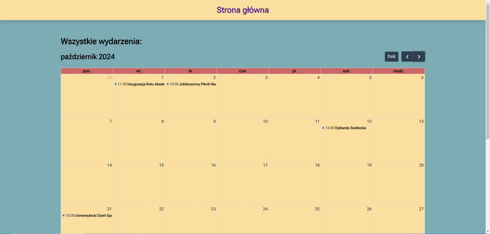
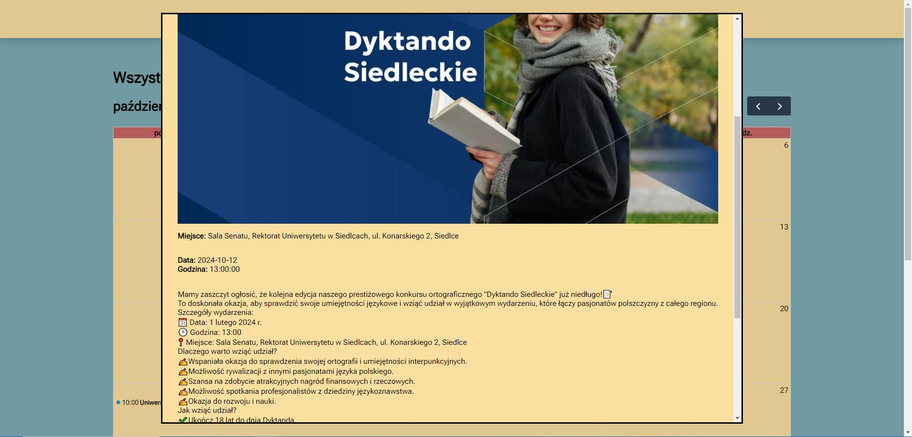

# Kalendarz wydarzeń

Projekt we Flask pobierający wydarzenia z API i wyświetlający je w kalendarzu FullCalendar.

## Instalacja

W wieszu polecenia / terminalu wprowadź poniższe komendy:

### Krok 1: Sklonowanie repozytorium

```sh
git clone https://github.com/pr3ston1989/flask-uws-2024.git
cd flask-uws-2024
```

### Krok 2: Utworzenie środowiska wirtualnego i instalacja zależności

#### Windows:

```sh
python -m venv venv
venv\Scripts\activate
pip install -r requirements.txt
```

#### Linux: 

```bash
python3 -m venv venv
source venv/bin/activate
pip install -r requirements.txt
```

### Krok 3: Ustawienie zmiennej środowiskowej dla klucza API

Zamień klucz_api na swój klucz i uruchom polecenie.

#### Windows:

```sh
set API_KEY=klucz_api
```

#### Linux: 

```bash
export API_KEY="klucz_api"
```

Opcjonalnie można umieścić klucz API w pliku .env w formacie API_KEY=klucz_api.

Plik musi znajdować się w katalogu głównym projektu.

### Krok 4: Uruchomienie aplikacji

```sh
flask run
```

Aplikacja domyślnie działa na porcie 5000 i będzie dostępna pod [tym](http://127.0.0.1:5000/) adresem.

### Opcjonalnie: Testowanie aplikacji

Będąc w katalogu głównym projektu wystarczy wpisać w terminalu polecenie:

```sh
pytest
```

## Demo

Działanie aplikacji można sprawdzić również w wersji live pod poniższym linkiem.

[Link do aplikacji](http://ec2-3-8-3-192.eu-west-2.compute.amazonaws.com/)

## Uruchomienie aplikacji z obrazu Dockera

### Krok 1: Pobranie obrazu z Docker Hub

#### Windows:

```docker pull dpietrzak89/flask-uws```

#### Linux:

```sudo docker pull dpietrzak89/flask-uws```

### Krok 2: Uruchomienie kontenera

Aby aplikacja działała prawidłowo, konieczne jest podanie klucza API.

W poniższej komendzie wystarczy zamienić 'kluczAPI' dla zmiennej środowiskowej -e API_KEY.

#### Windows:

```docker run -d --name twoja_nazwa_dla_kontenera -e API_KEY=kluczAPI -p 5000:5000 dpietrzak89/flask-uws```

#### Linux:

```sudo docker run -d --name twoja_nazwa_dla_kontenera -e API_KEY=kluczAPI -p 5000:5000 dpietrzak89/flask-uws```


Aplikacja będzie dostępna na localhost pod [tym](http://127.0.0.1:5000/) adresem.


## Screenshoty


